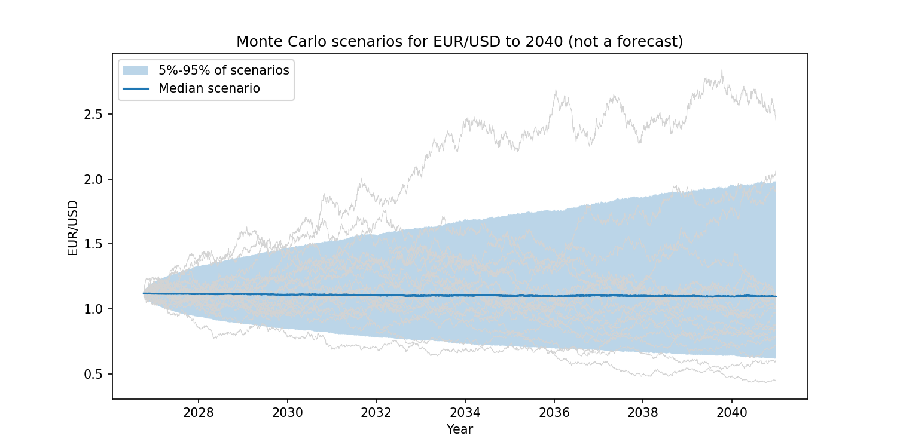

# Does a normal distribution underestimate EUR/USD risk? A rolling VaR backtest

**Question:** Is daily EUR/USD log-return data normally distributed, and does a normal-distribution assumption underestimate 99% Value-at-Risk compared with historical simulation?

A beginner-friendly guide to every concept used here (glossary with examples, the project step by step, exchange rates and macroeconomics, exercises) is in [`docs/quant_guide.pdf`](docs/quant_guide.pdf). Its LaTeX source is in `docs/`.

## Data

ECB euro foreign exchange reference rates, EUR/USD, daily. The rate is the ECB reference rate from a concertation in the early afternoon (around 14:10-14:15 CET), published around 16:00 CET, one number per day with no bid/ask.

- Source: European Central Bank, euro foreign exchange reference rates
- URL used by the script: https://data-api.ecb.europa.eu/service/data/EXR/D.USD.EUR.SP00.A?format=csvdata
- Source acknowledged: European Central Bank. The data is downloaded by the script into `data/eurusd.csv` on your own machine. It is git-ignored and is not redistributed or modified in this repository.

## How to run

```
pip install -r requirements.txt
python var_eurusd.py          # downloads the ECB data the first time, then uses data/eurusd.csv
pytest                        # tests of the helper functions
```

Tested with Python 3.12, numpy 2.5, scipy 1.18 and matplotlib 3.11. The minimum versions in `requirements.txt` have not been tested.

Run the commands from inside this folder. If the automatic download fails (for example a blocked connection), open the URL above in a browser, save the file as `data/eurusd.csv` (create the `data` folder first) and run the script again. Figures are saved in `figures/`. The backtest takes about 10 seconds.

To rebuild the guide (needs a LaTeX installation): `cd docs`, then `pdflatex quant_guide`, `bibtex quant_guide`, `pdflatex quant_guide` and `pdflatex quant_guide` again.

## Method

- Log returns in percent: `r_t = 100 * ln(P_t / P_(t-1))`.
- **Test 1, Jarque-Bera:** tests whether the returns are normal, using skewness and excess kurtosis (chi-square, 2 degrees of freedom).
- Rolling backtest with no look-ahead: for every day, VaR is estimated from the 500 returns before that day.
- Three VaR methods at 95% and 99%: parametric normal (`mean + z * std`), historical simulation (empirical quantile of the window) and Monte Carlo normal (10000 draws from a normal with the window's mean and std, fixed random seed).
- VaR is a positive percentage loss. An exceedance is a day with `r_t < -VaR`.
- **Test 2, Kupiec:** tests whether the exceedance rate equals 1 minus the confidence level (likelihood ratio, chi-square, 1 degree of freedom).

## Results

Real ECB data, 1999-01-04 to 2026-10-07 (7108 returns, 6608 backtest days).

Jarque-Bera: 3243.9, p-value < 0.001, so normality is rejected (excess kurtosis 3.31, skewness 0.05).

| Method | Level | Exceedances | Expected | Kupiec p-value |
|---|---|---|---|---|
| Normal (parametric) | 95% | 302 | 330.4 | 0.1040 |
| Historical simulation | 95% | 324 | 330.4 | 0.7171 |
| Monte Carlo normal | 95% | 302 | 330.4 | 0.1040 |
| Normal (parametric) | 99% | 114 | 66.1 | 0.0000 |
| Historical simulation | 99% | 74 | 66.1 | 0.3367 |
| Monte Carlo normal | 99% | 114 | 66.1 | 0.0000 |

The script prints a Kupiec p-value of 0.0000 when it is below 0.0001. The ECB file grows every working day, so a run on newer data gives slightly different numbers; the table uses data up to 2026-10-07.

At 99% the normal VaR is exceeded 114 times instead of about 66, so it underestimates risk. Historical simulation is not rejected. At 95% no method is rejected, but that only says the *frequency* of exceedances is consistent with 5%. It does not mean that the returns are normal (Jarque-Bera rejects that). Monte Carlo normal is close to the parametric normal because both assume a normal distribution; the exceedance counts happen to be identical in this run.

## Scenario analysis to 2040



This is a scenario analysis, **not a forecast**. `scenario_to_2040` simulates 5000 possible paths for EUR/USD from the last observed rate (1.1177) to the end of 2040. Every future day is drawn at random from the real historical daily returns (bootstrap), so the fat tails found by the Jarque-Bera test are kept. The log returns are added up day by day and turned back into exchange rates.

At the end of 2040 the 5th to 95th percentile of the scenarios is about 0.62 to 1.99, with a median of about 1.10. The band is wide and grows over time, which shows how uncertain a long horizon is. It does not say where the rate will be.

Limitations: days are drawn independently, so volatility clustering is not modelled; only events that happened between 1999 and 2026 can appear; the model has no view on the direction (the mean return is close to zero); and the day count uses 261 weekdays per year, a little more than the ECB data has.

## How to read the output

The Kupiec p-value tests the null hypothesis that the true exceedance rate equals the target (5% or 1%). A high p-value (for example above 0.05) means the observed number of exceedances is consistent with the target, so the VaR model is not rejected. A low p-value (below 0.05) means the model produces too many or too few exceedances, so it is rejected. Too many exceedances means VaR is too low (risk underestimated); too few means VaR is too high (too conservative).

Be careful with short windows. At 99%, about 250 trading days give only 2.5 expected exceedances, so the test has low power: it can hardly reject anything. The full backtest has more days, but the 99% level still has few exceedances compared with the 95% level.

A result where the normal assumption holds is also a valid result. If the normal VaR passes the Kupiec test, that is the finding, and it should be reported as it is.

## Limitations

- Daily ECB fixing, not tick data. Intraday moves and the exact time of the fixing are not captured.
- No bid/ask spread and no trading costs.
- The Kupiec test checks only how often exceedances happen, not whether they come in clusters. There is no independence test.
- One currency pair and one data source only.
- The 2040 scenarios assume the future looks like 1999-2026.

## Possible extensions

- Christoffersen independence test
- Student-t fit as a fourth VaR method
- Other pairs such as EUR/SEK and EUR/CHF
- GARCH or EWMA volatility instead of a constant-volatility window
- Expected shortfall (the average loss on exceedance days)

## AI use and disclaimer

This project was built with AI assistance (Claude, including a research agent and a writing agent). The code and the guide were afterwards reviewed by two other AI systems. See [`AI_USE.md`](AI_USE.md) for a task-by-task log. This is an educational project, not investment advice.

## License

MIT, see `LICENSE`. ECB data is not covered by this license and belongs to the ECB.
